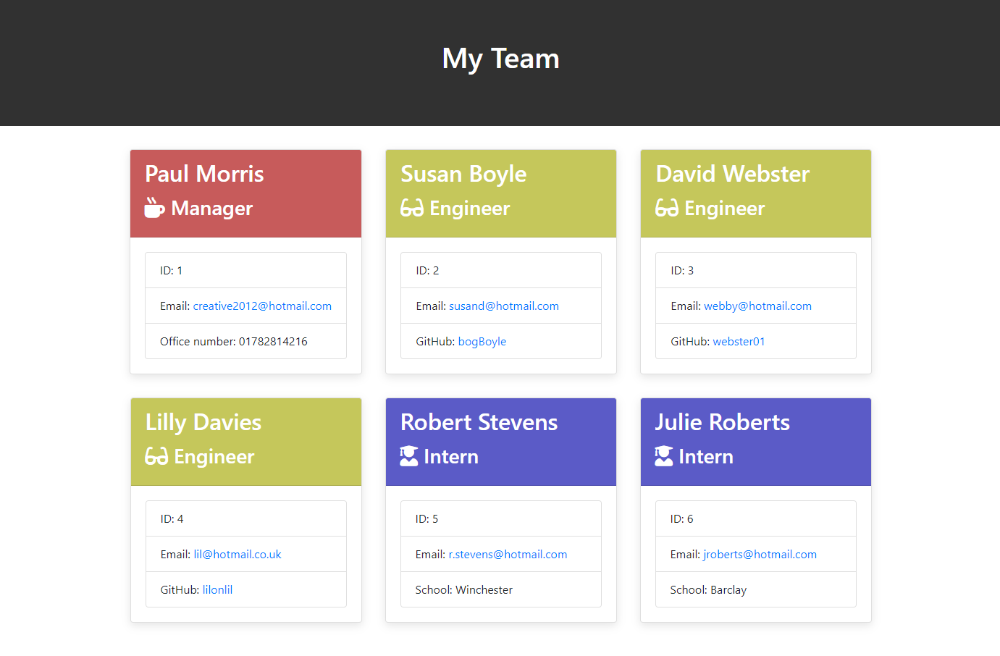

# Team-Profile-Generator
  

## Description
This application will take in information about employees on a software engineering team, then generate an HTML webpage that displays summaries for each person. 
 > An example of the HTLML file generated by this application can be found in the "output" directory.

## Table of Contents
* [Installation Instructions](#install)
* [Tests](#tests)
* [Usage Information](#usage)
* [Credits](#credits)
* [Licence](#license)

## Install
Clone the repository to your computer using "git clone" and then follow the below guide.
1.  Ensure that your application includes the require dependacies, by typing the commnd in your integrated terminal "npm install inquirer@6.5.0".
2.  Create a .gitignore file and include node_modules/ and .DS_Store/ so that your node_modules directory isn't tracked or uploaded to GitHub.
3.  Run “node index.js” to begin.

## Tests
1.  Ensure that your application includes the required Dev dependacies, by typing the commnd in your integrated terminal "npm install --save-dev jest".
2. run "npm test" to run tests.
 > The tests are included in the "__tests__" directory and check the integrity of the employee type class models.

## Usage
Run “node index.js” in your terminal and follow the prompts. At the end, your team HTML file will be stored in the "output" directory.

The Following image shows a mock-up of the generated HTML, feel free to add your own css styles to the style.css file located in the "output" directory.

## Credits

Skills for Life Boot Camp

## License

MIT License

Copyright (c) 2022 creative2012

Permission is hereby granted, free of charge, to any person obtaining a copy
of this software and associated documentation files (the "Software"), to deal
in the Software without restriction, including without limitation the rights
to use, copy, modify, merge, publish, distribute, sublicense, and/or sell
copies of the Software, and to permit persons to whom the Software is
furnished to do so, subject to the following conditions:

The above copyright notice and this permission notice shall be included in all
copies or substantial portions of the Software.

THE SOFTWARE IS PROVIDED "AS IS", WITHOUT WARRANTY OF ANY KIND, EXPRESS OR
IMPLIED, INCLUDING BUT NOT LIMITED TO THE WARRANTIES OF MERCHANTABILITY,
FITNESS FOR A PARTICULAR PURPOSE AND NONINFRINGEMENT. IN NO EVENT SHALL THE
AUTHORS OR COPYRIGHT HOLDERS BE LIABLE FOR ANY CLAIM, DAMAGES OR OTHER
LIABILITY, WHETHER IN AN ACTION OF CONTRACT, TORT OR OTHERWISE, ARISING FROM,
OUT OF OR IN CONNECTION WITH THE SOFTWARE OR THE USE OR OTHER DEALINGS IN THE
SOFTWARE.
